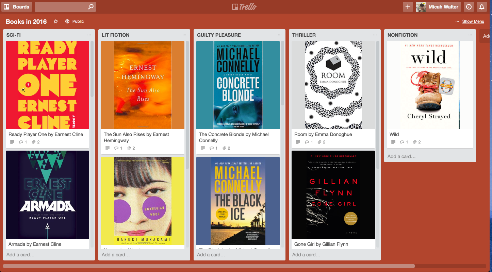

# All the books I read in 2016

Day 14,921

It's gray out. Raining, even. So, here's one of those lists of all the books I read in 2016. And, since I basically use [Trello](http://trello.com) for organizing my entire brain, I thought I'd stick these in a [public Trello board](http://micahwalter.net/2jWds9I), complete with little quips on what I read and why.

I read about twenty books in 2016. There's probably a few I left out. It's about half my goal for 2017. I'm still working on [book 1](https://www.amazon.com/Inevitable-Understanding-Technological-Forces-Future/dp/0525428089) for 2017, so I need to get reading!
 
[Check out the board](http://micahwalter.net/2jWds9I)!

What are you reading?

See a typo? Send me a [pull-request](https://github.com/micahwalter/blogs-14921-all-the-books)!

